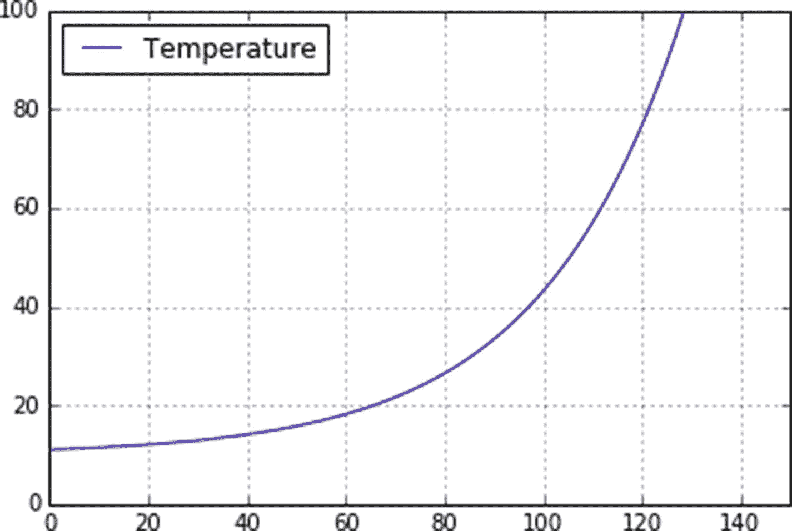
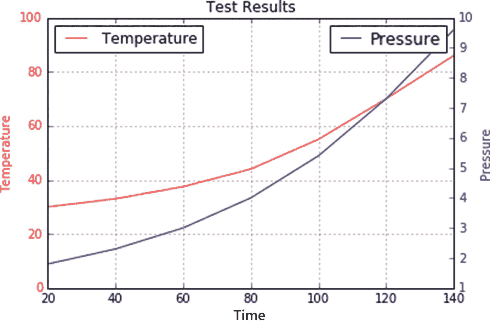
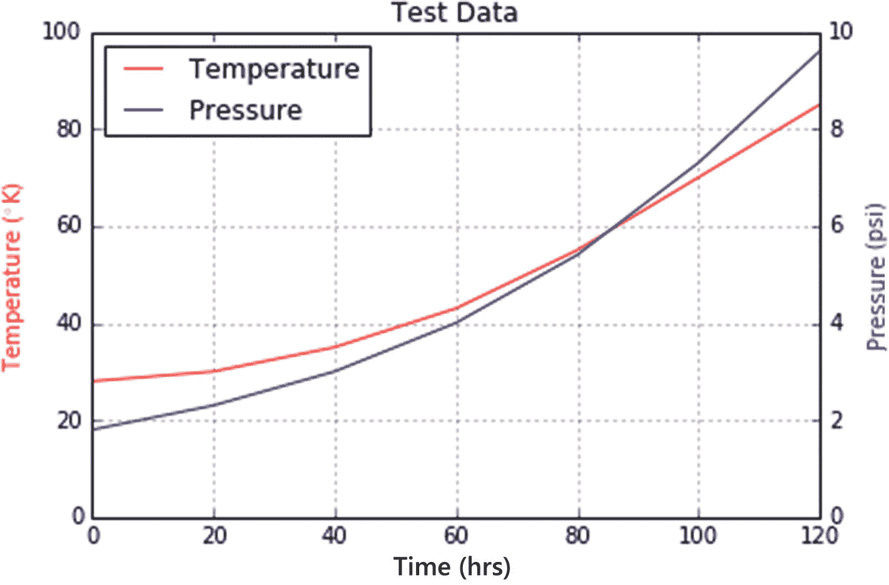
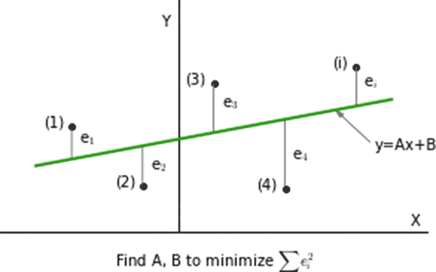
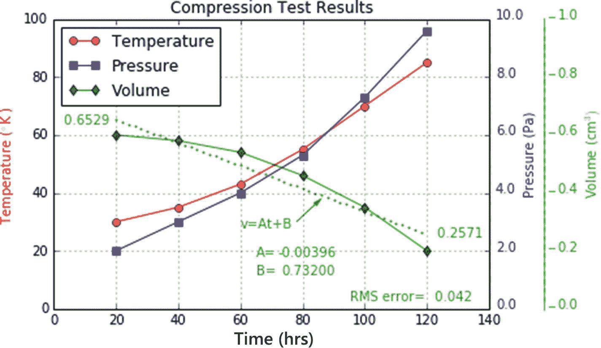
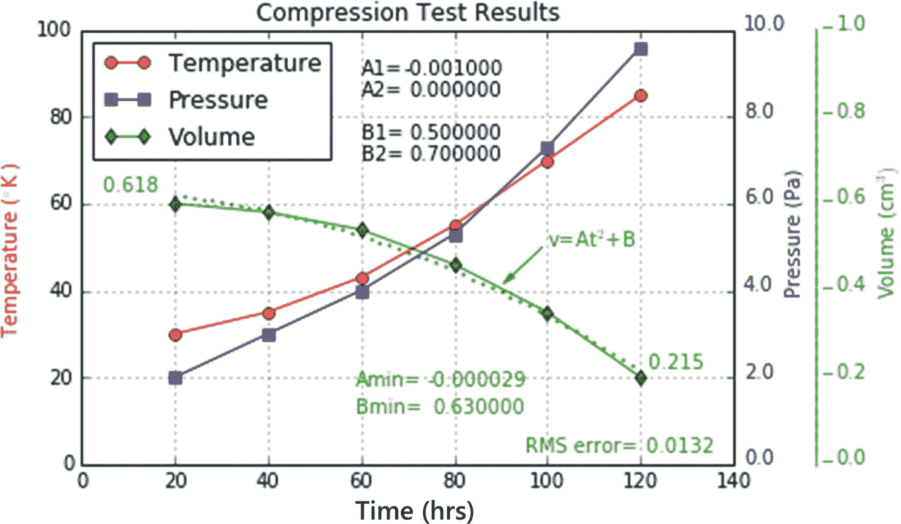
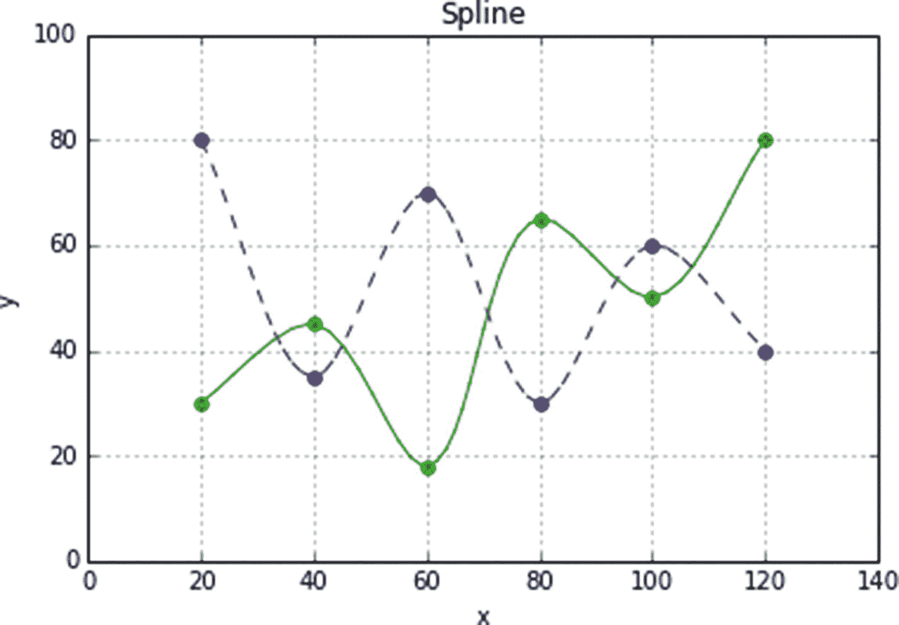
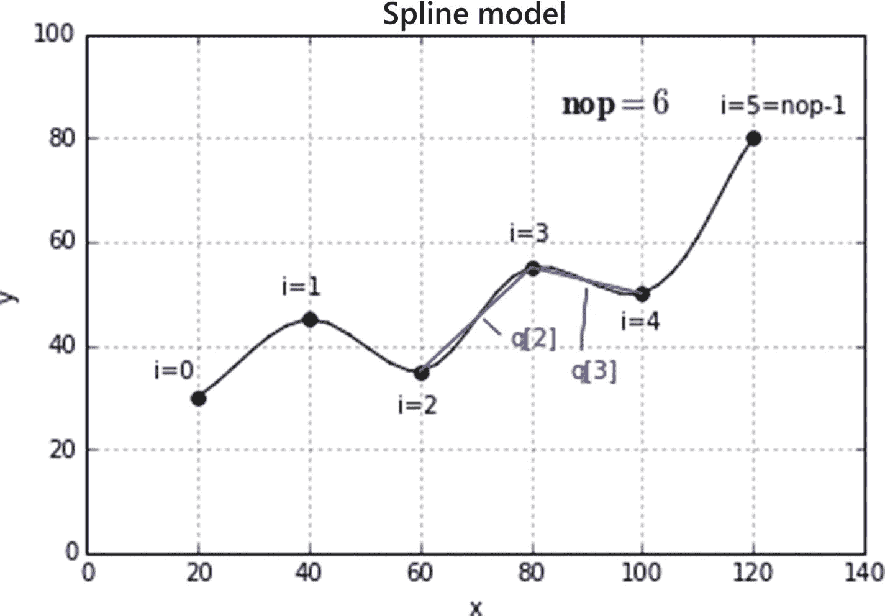

# 8.2D 数据绘图

在这一章中，你将看到绘制二维数据的样式和技术。您将从一些简单的图开始，然后发展到在同一个图上包含多组数据的图。虽然 Python 包含专门的内置函数，在这方面非常有效，通常只需要几行代码，但您会发现，您可以通过采取更实用的方法来美化您的图形，并通过用简单的 Python 命令补充专门的 Python 函数来发挥创造力。例如，输入设置和数据后，图 [8-1](#Fig1) 中的图只需要三行专用代码。另一方面，图 [8-5](#Fig5) 仅仅使用专门的 Python 命令来创建可能是一个挑战。使用简单的命令，再加上一点创造性，可以使工作变得容易得多。在简单的数据绘图之后，您将继续进行线性回归，将直线拟合到数据集。然后，您将看到如何将非线性数学函数拟合到数据中。你用样条来结束。样条是通过每个数据点的平滑曲线。

图 [8-1](#Fig1) 显示了一个数学函数的曲线图。这个情节是通过列举 [8-1](#Par4) 创造出来的。其中，第 13 行设置了 x 轴的数值范围，在本例中是从 0 到 150，步长为 1。这意味着函数将在该范围内绘制。第 8 行中的轴定义具有相同的限制，但是它们可能不同。例如，如果第 8 行是 plt.axis([0，200，0，100])，则绘图区域的宽度将为 200，但仍将从 0 到 150 绘制函数。这种组合会将函数图定位在绘图区域的左侧。

第 14 行定义了正在绘制的函数。这是 y1 与 x 的简单指数函数。第 17 行用蓝色绘制，并附上标签`'` y1 `'`，这将由第 20 行的 legend()函数使用。在第 20 行，loc 等于图例的位置，可以是上、中、下与左、中、右的任意组合。这里你用的是`'`左上角的`'`。如果你指定`'` best `'`，Python 会为它确定最佳位置。如您所见，第 13、14 和 17 行基本上包含了整个绘图操作。



图 8-1

Data plot produced by Listing [8-1](#Par4)

```py
1  """
2  DATAPLOT1
3  """
4
5  import matplotlib.pyplot as plt
6  import numpy as np
7
8  plt.axis([0,150,0,100])
9  plt.axis('on')
10 plt.grid(True)
11
12 #——————————define function y1 vs x
13 x=np.arange(0,150,1)
14 y1=10+np.exp(.035*x)
15
16 #——————————plot y1 vs x
17 plt.plot(x, y1,'b',label='y1')
18
19 #——————————–plot the legend
20 plt.legend(loc='upper left')

21
22 plt.show()
Listing 8-1
Program DATAPLOT1

```

在清单 [8-2](#Par7) 中，您在同一个图上绘制了两个函数 y1 和 y2。第 18 行和第 19 行进行绘制。添加标签“温度”和“压力”，这将由 legend()函数使用。在第 25 行，您添加了 marker= `'` s `'`，它在温度曲线的每个数据点绘制了一个正方形；第 26 行中的 marker= `'` * `'`在压力曲线的每个点绘制了一个星形。 [`https://matplotlib.org/api/markers_api.html`](https://matplotlib.org/api/markers_api.html) 还有其他标记样式。

在图 [8-2](#Fig2) 中，注意数据图的水平范围(20-140)小于绘图宽度(0-150)。让数据不撞上图的边缘有时可以使它更具可读性。要使数据图跨越图的整个宽度，只需将第 8 行改为 plt.axis([20，140，0，100])。同样，y 值的范围也可以改变。


图 8-2

Data plot produced by Listing [8-2](#Par7)

```py
1  """
2  DATAPLOT2
3  """
4
5  import matplotlib.pyplot as plt
6  import numpy as np
7
8  plt.axis([0,150,0,100])
9  plt.axis('on')
10 plt.grid(True)
11
12 #—————————————define data points
13 x=[20,40,60,80,100,120,140]
14 y1=[30,50,30,45,70,43,80]
15 y2=[45,35,40,60,60,55,70]
16
17 #—————————————plot lines with labels
18 plt.plot(x,y1,'b',label='Temperature')
19 plt.plot(x,y2,'r',label='Pressure')
20
21 #—————————————legend
22 plt.legend(loc='upper left')
23
24 #—————————————add markers
25 plt.scatter(x,y1,color='b',marker='s')
26 plt.scatter(x,y2,color='r',marker='*',s=50)
27
28 plt.show()

Listing 8-2
Program DATAPLOT2

```

在清单 [8-2](#Par7) 中，针对一个 y 轴显示了两个函数，温度和压力。当然，这是假设 y 轴上的值对 T 和 p 都合适，但是如果压力值比温度值大得多或小得多呢？压力图可能会脱离图表或太小而不明显。你需要两个垂直标尺，一个测量温度，另一个测量压力。

在清单 [8-3](#Par10) 中，您降低了压力值，如第 14 行所示。如果用与温度相同的垂直刻度来绘制，它们在图上会显得太低。您可以通过引入第二个垂直轴来解决这个问题。第 17-20 行绘制了温度数据。第 20 行允许您将垂直刻度线的颜色更改为任何颜色，在本例中为红色。第 21 行在左上角绘制了一个图例。第 24-27 行在图的右侧绘制了第二个刻度。第 24 行建立了一个“孪生”绘图轴。这个孪生包括已经建立的水平 x 轴加上右侧新的垂直 y 轴。该组中的其余命令指的是第二个 y 轴。第 26 行将该轴标为压力。第 27 行将刻度线和数字改为蓝色。第 28 行在右上角绘制了第二个图例。如果您尝试为温度和压力绘制一个图例，您会发现结果取决于您在代码中放置 legend()函数的位置。如果您使用两个独立的图例()，就像您在这里所做的一样，并将它们放在相同的位置，比如左上角，一个会覆盖另一个。如果您尝试在代码末尾仅使用一个图例()，它将显示一个图例，其中仅显示压力。见图 [8-3](#Fig3) 。在下一期节目中，你会看到解决这个问题的方法。



图 8-3

Data plot produced by Listing [8-3](#Par10)

```py
1  """
2  DATAPLOT3
3  """
4
5  import matplotlib.pyplot as plt
6  import numpy as np
7
8  plt.axis([0,140,0,100])
9  plt.axis('on')
10 plt.grid(True)
11
12 t=[20,40,60,80,100,120,140] #———Time
13 T=[30,33,37.5,44,55,70,86] #———Temperature
14 p=[1.8,2.3,3,4,5.4,7.3,9.6] #———Pressure
15
16 #———————Plot T vs t in red on the left vertical axis.
17 plt.plot(t,T,color='r',label='Temperature')
18 plt.xlabel('Time')
19 plt.ylabel('Temperature',color='r')
20 plt.tick}_params(axis='y',labelcolor='r')
21 plt.legend(loc='upper left')
22
23 #———————Plot P vs t in blue on the right vertical axis.
24 plt.twinx()
25 plt.plot(t,p,color='b',label='Pressure')
26 plt.ylabel('Pressure', color="b")
27 plt.tick_params(axis='y', labelcolor="b")
28 plt.legend(loc='upper right')
29
30 #———————title the plot
31 plt.title('Test Results')
32
33 plt.show()

Listing 8-3
Program DATAPLOT3

```

在清单 [8-4](#Par12) 中，您尝试解决在之前的程序中遇到的 legend()问题。第 12 行设置了一个名为 ax1 的情节，其中包括一个子情节。第 14 行绘制了一个网格。第 8-10 行建立了数据列表。第 16 行标记了 x 轴。第 18 行用红色绘制了温度曲线，并将其命名为 l1。第 20 行设置左侧垂直轴上的比例限制，范围从 0 到 100。第 21 行用红色标记它。第 23 行将 twin()的第二个垂直轴(包括 x 轴)设置为 ax2。第 25 行用蓝色绘制了曲线 l2。第 27 行将比例限制设置为 0-10。第 28 行标记了它。第 30 行和第 31 行指定了将出现在图例中的曲线。第 32 行绘制了图例。语法看起来有点神秘，但确实有效，如图 [8-4](#Fig4) 所示。



图 8-4

Data plot produced by Listing [8-4](#Par12)

```py
1  """
2  DATAPLOT4
3  """
4
5  import matplotlib.pyplot as plt
6  import numpy as np
7
8  t=[0,20,40,60,80,100,120]
9  T=[28,30,35,43,55,70,85]
10 p=[1.8,2.3,3,4,5.4,7.3,9.6]
11
12 fig, ax1 = plt.subplots() #———set up a plot ax1 with subplots
13
14 plt.grid(True) #———draw grid
15
16 ax1.set_xlabel('Time (hrs)') #———label X axis of ax1
17
18 l1=plt.plot(t,T,'r',label='Temperature') #———plot temperature in red as curve l1
19
20 ax1.set_ylim([0,100]) #———set Y axis limits of ax1
21 ax1.set_ylabel(r'Temperature (° K)', color="r") #———label Y axis of ax1
22
23 ax2 = ax1.twinx() #———set up ax2 as twin of ax1
24
25 l2=plt.plot(t, p, 'b',label='Pressure') #———plot pressure in blue as curve l2
26
27 ax2.set_ylim([0,10]) #———set Y axis limits of ax2
28 ax2.set_ylabel('Pressure (psi)', color="b") #———label Y axis of ax2
29
30 line1,=plt.plot([1],label='Temperature',color='r') #———line 1 of legend
31 line2,=plt.plot([2],label='Pressure',color='b') #———line 2 of legend
32 plt.legend(handles=[line1,line2],loc='upper left') #———plot legend
33
34 plt.title('Test Data')

Listing 8-4
Program DATAPLOT4

```

在清单 [8-5](#Par15) 中，您绘制了多条曲线，并给出了每条曲线自己的垂直刻度。第 12-14 行定义了时间、温度和压力数据的列表。在第 15 行中，您引入了第三个因变量 volume v。第 17 行打开了一个名为 pp=[ ]的新列表，它将用于垂直缩放压力数据。您可以简单地缩放和替换 p=[ ]中的项目，但这样会破坏原始值。这在这个程序中不是问题，但是让它们保持不变是个好习惯。第 18-19 行将包含在 p 中的原始压力值缩放 10 倍，并将它们附加到 pp 中。对第 21-23 行中的 v 执行相同的操作，其中体积数据被缩放 100 倍。第 25-28 行绘制了曲线和图例。第 30-33 行用蓝色绘制了右侧 y 轴上的压力刻度。第 35-37 行标记了三个轴。第 39-43 行用绿色标出了音量刻度值。第 45-46 行绘制了垂直的绿色轴。这是通过将字符“|”绘制为右侧的文本来实现的。通常，您会希望从垂直体积轴从上到下绘制一条直线，但是 Python 不允许在主绘制区域之外绘制直线或散点。但是，它允许文本。所以你用一系列的“|”符号构造了一条垂直线。如果您愿意，可以用这种方式添加更多的垂直轴。见图 [8-5](#Fig5) 。

本课程中使用的方法比以前更注重实践。以前的程序主要依赖于专门的 Python 语法。这种方法的优点是它有效，非常灵活，并且不需要太多代码。这种 Python 语法与实践技巧的创造性结合实际上非常强大。有时候跳出框框思考是值得的。


图 8-5

Data plot produced by Listing [8-5](#Par15)

```py
1  """
2  DATAPLOT5
3  """
4
5  import matplotlib.pyplot as plt
6  import numpy as np
7
8  plt.axis([0,140,0,100])
9  plt.axis('on')
10 plt.grid(True)
11
12 t=[20,40,60,80,100,120] #———time
13 T=[30,35,43,55,70,85] #———temperature
14 p=[2,3,4,5.3,7.3,9.6] #———pressure
15 v=[.6,.58,.54,.46,.35,.2] #———volume
16
17 pp=[ ] #———list for scaled pressure for plotting
18 for i in np.arange(0,len(p),1):
19       pp.append(p[i]*10) #———scale p by 10
20
21 vv=[ ] #———list for scaled volume for plotting
22 for i in np.arange(0,len(v),1):
23       vv.append(v[i]*100) #———scale volume by 100
24
25 plt.plot(t,T,color='r',label='Temperature',marker='o') #———plot temperature
26 plt.plot(t,pp,color='b',label='Pressure',marker='s') #———plot scaled pressure
27 plt.plot(t,vv,color='g',label='Volume',marker='d') #———plot scaled volume
28 plt.legend(loc='upper left')
29
30 for y in np.arange(0,100+1,20): #———plot pressure scale values
31      a=y/10
32      a=str(a) #———convert to string for plotting as text
33      plt.text(142,y,a,color='b')
34
35 plt.xlabel('Time (hrs)') #———label axes
36 plt.ylabel('Temperature °K',color='r')
37 plt.text(151,65,'Pressure (psi)',rotation=90,color='b')
38
39 for y in np.arange(100,-1,-20): #———plot volume scale values
40      a=y/100
41      a=str(a)
42      plt.text(162,y,a,color='g')
43      plt.text(159,y+2,'_',color='g')
44
45 for y in np.arange(1,99,3):
46      plt.text(157,y,'—',color='g')
47
48 plt.text(170,65,r'Volume (cm3)',rotation=90,color='g') #———label volume scale
49
50 plt.title('Compression Test Results') #—title
51
52 plt.show()
Listing 8-5
DATAPLOT5

```

## 8.1 线性回归

线性回归是将一条直线拟合到一组数据点的过程。参考图 [8-6](#Fig6) 和 [8-7](#Fig7) ，目标是确定一条直线的参数 A 和 B，


(8-1)，这些参数产生数据点的最佳拟合。b 是直线的 y 轴截距，A 是直线的斜率。每个数据点 I 具有坐标 x <sub>i</sub> ，y <sub>i</sub> 。每个都有一个相对于直线的误差 e <sub>i</sub> 。直线与数据点的最佳拟合将是 A 和 B 产生


【8-2】的直线，其中 n 是数据点的数量。这相当于将均方根误差降至最低。e <sub>i</sub> 在等式 [8-2](#Equ2) 中被平方，以说明 e <sub>i</sub> 的负值。可以看出，当


【8-3】


【8-4】


【8-5】


【8-6】


【8-7】


【8-8】时，满足方程 [8-2](#Equ2)

在清单 [8-6](#Par22) 中，从第 52 行开始，回归例程被添加到清单 [8-5](#Par15) 中。它用一条回归线来拟合绿色体积曲线。第 55-60 行计算上面定义的 C1-C4 系数。第 55 行的 np.sum()对列表 t 中的元素求和。第 57 行的 np.multiply()将列表 v 和 t 中的元素逐个相乘，产生列表 A。第 58 行然后将 A 中的元素相加。第 62 和 63 行根据等式 [8-3](#Equ3) 和 [8-4](#Equ4) 计算 A 和 B。第 65-68 行使用散点绘制回归线；第 66 行将 v 对 t 的值计算为 vp，v 的标绘值；第 67 行将 vp 缩放 100 用于绘图；第 68 行进行了绘图。

等式 [8-2](#Equ2) 表明，最小化σe(i)<sup>2</sup>，其中 e(I)是数据点 I 与回归线的偏差，相当于最小化均方根值。均方根值为

![$$ RMS={\left[\frac{\sum \limits_{1=1}^ne{(i)}^2}{n}\right]}^{\frac{1}{2}} $$](A456962_1_En_8_Chapter_Equ9.gif)

(8-9)

这是在第 71-76 行计算的。e(i)在第 73 行计算。它在第 74 行被平方为 ee，然后在第 75 行被求和为 sumee，产生等式 [8-9](#Equ9) 中的分子。根据等式 [8-9](#Equ9) 在第 76 行计算 RMS。很明显，最小化σe(I)<sup>2</sup>相当于最小化均方根值。

程序的其余部分将标签和值放置在绘图上。第 83 行减少了回归线的起始值 vp1 的位数；第 84 行绘制了它。第 86-88 行绘制了最终值。a 和 B (Ap 和 Bp)类似地绘制在线 90-96 中。

除了第 83 行中使用的语法之外，Python 中还有其他减少位数的方法。但是，如果被缩短的数字是负数，减号可能不会出现在输出中。这可能是 Python 某些版本的问题。



图 8-7

Model used by Listing [8-6](#Par22) showing data points 1,2,3,4…i with straight line fit. e<sub>i</sub>=error from straight line for data point i.



图 8-6

Straight line fit to the volume curve produced by Listing [8-6](#Par22)

```py
1  """
2  REGRESSION1
3  """
   .
   .
   #——————————same as DATAPLOT5——————————
   .
   .
52 #—————————————straight line fit to Volume v vs t
53 n=len(v)
54
55 c1=np.sum(t)/n #———sum values of list t and divide by n, =average of t
56 c2=np.sum(v)/n #———sum values of list v and divide by n, =average of v
57 a=np.multiply(v,t) #———multiply list v by t element by element = list a
58 c3=np.sum(a) #———sum elements of a
59 a=np.multiply(t,t) #———multiply list t by t element by element = list a
60 c4=np.sum(a) #———sum elements of a
61
62 A=(c3-n*c1*c2)/(c4-n*c1*c1) #———line parameters A and B
63 B=c2-A*c1
64
65 for tp in np.arange(t[0],t[5],2): #———plot line with scatter dots
66      vp=A*tp+B
67      vp=vp*100 #———scale vp for plotting
68      plt.scatter(tp,vp,color='g',s=1)
69
70 #—————————————————————calculate RMS error
71 sumee=0
72 for i in range(len(t)):
73      e=(v[i]-(A*t[i]+B))
74      ee=e*e
75      sumee=sumee+ee
76      rms=np.sqrt(sumee/n)
77     
78 #—————————————————labels
79 plt.text(60,28,'v=At+B',color='g')
80 plt.arrow(78,30,6,6,head_length=3,head_width=1.5,color='g',linewidth=.5)
81
82 vp1=A*t[0]+B #——————beginning v value of line
83 vp1='%7.4f'%(vp1) #——————reduce the number of decimal places
84 plt.text(2,64,vp1,color='g') #———plot
85
86 vp2=A*t[5]+B #——————end v value of line
87 vp2='%7.4f'%(vp2)
88 plt.text(122,25,vp2,color='g')
89
90 Ap='%7.5f'%(A)
91 plt.text(65,18,'A=',color='g')
92 plt.text(72,18,Ap,color='g') #———print value of A
93
94 Bp='%7.5f'%(B)
95 plt.text(65,12,'B=',color='g')
96 plt.text(73,12,Bp,color='g') #———print value of B
97
98 rms='%7.3f'%(rms)
99 plt.text(95,3,'RMS error=',color='g')
100 plt.text(123,3,rms,color='g') #———print RMS error
101
102 plt.show()
Listing 8-6
REGRESSION1

```

## 8.2 功能拟合

在清单 [8-6](#Par22) 中，您绘制了一条直线来拟合代表体积与时间测量值的数据点。你很幸运，这个问题有一个解析解，由方程 [8-2](#Equ2) 、 [8-3](#Equ3) 和 [8-5](#Equ5) 表示。在本节中，您将为同一个数据集拟合一个任意函数。该函数是用户定义的；也就是说，你可以指定任何你想要的函数，任何你认为合适的函数。在清单 [8-7](#Par29) 中，您将尝试关系


(8-10)

如前一节所述，您的任务是找到 A 和 B 的值，使该函数与数据点最佳拟合。因为你希望能够使用任何任意函数，所以为你希望尝试的每个函数推导出问题的封闭形式的解决方案显然是不省时的。在这里，您将使用一种强力方法，该方法涉及计算等式 [8-10](#Equ10) 中参数 A 和 B 的值，在两者的预期范围内获得最小均方根误差。这是一种实践方法；需要对这个问题有所了解。例如，检查图 [8-8](#Fig8) 和方程 [8-10](#Equ10) 中的 v(t)曲线表明，方程 [8-10](#Equ10) 中的参数 B，即 t=t[0]时的 V 轴(绿色)截距，应该位于. 5 和. 7 之间。类似地，你可以假设 A 会很小，因为等式 [8-10](#Equ10) 涉及 t 的平方，其值大到 t[5]=120。你也可以通过检查看到，A 应该是负数。因此，您可以尝试从-.001 到 0 的范围。计算 B 值在. 5 和. 7 之间以及 A 值在-.001 和 0 之间的许多组合的误差。这将给出对应于这些范围之间几乎最低误差的 A 和 B。我说“几乎”最低误差是因为，当在 A 和 B 的预期范围之间循环时，你是以小步进行的。这些步骤越精细，你的最终解决方案就越精确。虽然您可以使用自动迭代技术，但是这里描述的过程更容易编码，但是涉及到用户迭代。它的工作方式如下:猜测 A 和 B 的初始范围后，当您得到结果时，您可以通过关闭、打开或移动范围来使用精确的值进行另一次运行。您还可以更改搜索增量 dB(第 61 行)和 dA(第 64 行)。只要进行几次这样的手工迭代，您就应该能够得到您所需要的任何精度的解决方案。

参照清单 [8-7](#Par29) ，大部分与清单 [8-6](#Par22) 相同。第 59-64 行定义了搜索例程 B1 和 B2 的界限，它们是 B 范围的开始和结束；A 范围的 A1 和 A2。dB 和 dA 是增量。较小的增量会产生更准确的结果，但需要更多的处理时间。从第 70 和 71 行开始的两个嵌套循环首先搜索 B 范围，然后对于 B 的每个值，搜索 A 范围。在 A 和 B 的每个组合处，从第 73 行开始的循环循环通过所有的数据点，len(t) (=len(v))。第 74 行计算每个数据点和假设函数方程 [8-10](#Equ10) 之间的误差；第 75 行对其求平方，第 76 行根据等式 [8-2](#Equ2) 对误差的平方求和。在第 72 行，总和最初被设置为零。第 77 行说，如果 A 和 B 的当前组合产生的平方和小于先前计算的总和，那么用当前值替换该值，并将 A 和 B 的当前值设置为 Amin 和 Bmin，这些值对应于当前最低误差。当 A 和 B 环路第一次循环时，第 76 行中的 eemin 是未知的。它在第 56 行被设置为非常高的值。这确保了第一个 eemin 会更少。在第一个周期之后，它将采用对应于产生最低 sumee 值的 A 和 B 的最新组合的值。所有这些的最终结果是在数据点和假设函数之间产生最小误差的 A 和 B 的值。他们是 Amin 和 Bmin。第 86-89 行使用第 87 行中的 Amin 和 Bmin 绘制了函数。第 92-97 行计算相应的均方根误差。

图 [8-6](#Fig6) 显示了 v(t)的直线近似值和 0.042 的均方根误差，如该图所示。使用非线性函数 Ax <sup>2</sup> +B 时，均方根误差为 0.0132，相当低。

程序的其余部分将标签放置在地块上。从图 [8-8](#Fig8) 中可以看出，第 59-64 行中设置的 A 和 B 的限值在图上以黑色打印为 A1、A2、B1 和 B2。程序找到的导致最小误差的值以绿色打印为 Amin 和 Bmin。在本例中，假设值为 A1、A2、B1 和 B2，Amin 和 Bmin 在假设范围内，因此您可以确信已经找到了接近最佳的值。但是让我们假设其中一个参数，比如 B1，选择错误。也就是说，假设你选择了 B1=.65，B2=.7。由程序计算的 Bmin 的结果是 B1 = .65 也就是说，它会撞上 B 下限。这将告诉你 B1 太高，你应该在下次运行时降低它。类似地，如果你选择了 B1=.5，B2=.6，那么 Bmin 将达到 B 的上限，这表明你应该提高 B2。

还有其他可用的曲线拟合函数，类似于您在这里开发的函数；去 [`https://docs.scipy.org/doc/scipy/reference/generated/scipy.optimize.curve_fit.html`](https://docs.scipy.org/doc/scipy/reference/generated/scipy.optimize.curve_fit.html) `.`其他的可以用互联网搜索找到。您在这里开发的这个具有开放、简单、易用的优势，而且您可以控制它。



图 8-8

Function fit to volume curve produced by Listing [8-7](#Par29)

```py
   """
   REGRESSION2
   """
52 #——————————same as REGRESSION1————————————
53
54 #———————————————————parabolic fit to v vs t
55 n=len(v)
56 eemin=10**10 #———starting value of eemin, deliberately set very large
57
58 #—————————————loop parameters
59 B1=.5
60 B2=.7
61 dB=.001
62 A1=-.001
63 A2=0.
64 dA=.0000001
65
66 #—————————————loop through all combinations of A and B
67 #—————————————within ranges defined by loop parameters
68 #—————————————searching for Amin, Bmin that produce
69 #—————————————best fit of function to data points
70 for B in np.arange(B1,B2,dB):
71     for A in np.arange(A1,A2,dA):
72         sumee=0
73         for i in range(len(t)):
74              e=(v[i]-(A*t[i]*t[i]+B)) #———error of data point i at A, B
75              ee=e*e #———error squared
76              sumee=sumee+ee #———sum of error squared
77              if sumee < eemin: #———if sum < present minimum eemin then
78                   eemin=sumee #———set new minimum = sumee
79                   Amin=A #———set new Amin = A
80                   Bmin=B #———set new Bmin = B
81
82 #—————————————Amin, Bmin above will produce best fit
83
84 #————————————-plot best fit function with scatter dots
85 #————————————-from t[0] to t[5] in steps=2
86 for tp in np.arange(t[0],t[5],2):
87      vp=Amin*tp*tp+Bmin
88      vp=vp*100 #—scale to plot
89      plt.scatter(tp,vp,color='g',s=1)
90
91 #—————————————————calculate RMS Error
92 sumee=0
93 for i in range(len(v)):
94      e=(v[i]-(Amin*t[i]*t[i]+Bmin)) #———error at each data point
95      ee=e*e #———error squared
96      sumee=sumee+ee #———sum of squared errors
97      rms=np.sqrt(sumee/n) #———RMS error
98
99 #————————————————————————labels
100 plt.text(100,50,'v=At+B',color='g')
101 plt.arrow(99,50,-6.5,-6.5,head_length=3,head_width=1.5,color='g',linewidth=.5)
102
103 A=Amin
104 B=Bmin
105
106 vp1=A*t[0]*t[0]+B
107 vp1='%7.3f'%(vp1)
108 plt.text(2,63,vp1,color='g')
109
110 vp2=A*t[5]*t[5]+B
111 vp2='%7.3f'%(vp2)
112 plt.text(119,22,vp2,color='g')
113
114 Ap='%8.6f'%(A)
115 plt.text(59,18,'Amin=',color='g')
116 plt.text(74,18,Ap,color='g')
117
118 Bp='%8.6f'%(B)
119 plt.text(59,12,'Bmin=',color='g')
120 plt.text(75.2,12,Bp,color='g')
121
122 rms='%7.4f'%(rms)
123 plt.text(95,3,'RMS error=',color='g')
124 plt.text(120,3,rms,color='g')
125
126 A1='%8.6f'%(A1)
127 plt.text(60,90,'A1=')
128 plt.text(69,90,A1)
129
130 A2='%8.6f'%(A2)
131 plt.text(60,85,'A2=')
132 plt.text(70.2,85,A2)
133
134 B1='%8.6f'%(B1)
135 plt.text(60,75,'B1=')
136 plt.text(70.2,75,B1)
137
138 B2='%8.6f'%(B2)
139 plt.text(60,70,'B2=')
140 plt.text(70.2,70,B2)
141
142 plt.show()

Listing 8-7Program REGRESSION2

```

## 8.3 花键

图 [8-9](#Fig9) 所示的曲线称为样条曲线。它们的特征在于它们通过它们各自的数据点，这些数据点显示为点。每一条都是“自然”的样条，因为末端没有扭曲。用微积分的说法，二阶导数在端点为零。



图 8-9

Spline curves produced by Listing [8-8](#Par49)

由薄木板条构成的花键曾一度广泛用于造船，在造船中需要制造光滑的船体形状。在放样室里，工人们将钉子钉进地板，然后在钉子周围弯曲薄木条。然后，弯曲的长条形状被描摹到下面的纸张或胶合板上。这个形状被用来切割建造过程中使用的全尺寸模具。“spline”一词被认为源自丹麦的 splind 或北弗里斯兰的 splinj，这两个地方都是古代造船地区。第二次世界大战后，在造船和飞机设计和建造中，机械样条的使用被数学推导的曲线所取代。

您将在此使用的样条的数学关系称为三次样条。它的形式有


(8-11)

由于样条曲线上的每个点都由两个坐标 x 和 y 定义，所以你需要两个版本的方程[8-11](#Equ11):


(8-12)


(8-13)

你的任务是确定系数 Ax → Cx 和 Ay → Cy。一旦你有了它们，你将能够绘制样条曲线。为此，在相邻数据点之间的线段之间拟合一个单独的 x 和 y 方程。例如，点 2 和点 3 之间的区域是一个线段；3 和 4 之间是另一段。您还可以使用每个数据段右侧和左侧的数据点信息。

图 [8-10](#Fig10) 显示了一组数据点和编号方案。nop=是数据点的数量。有六个数据点，所以 nop=6。有五个点间线段。您将使用列表来跟踪所有事情。记住，Python 希望列表以第[o] <sup>个</sup>元素开始。在点[3]，即第四个数据点，i=3。你看到长度 q[2]在左边，q[3]在右边。每一个都是弦长，从一点到下一点的直线距离。



图 8-10

Model used by Listing [8-8](#Par49)

现在只参考方程 [8-12](#Equ12) 中的 x 方程，你可以将点【3】，MX【3】处的“斜率”定义为

![$$ mx\left[3\right]=\left(\frac{x\left[3\right]-x\left[2\right]}{q\left[2\right]}+\frac{x\left[4\right]-x\left[3\right]}{q\left[3\right]}\right)\ast .5 $$](A456962_1_En_8_Chapter_Equ14.gif)

(8-14)

这是左侧“斜率”和右侧点[3]的平均值。我用引号将“斜率”括起来，以强调它不是传统意义上的斜率，例如 y/x，而是每个 x 除以弦长 q[ ]。对于任意一点【我】

![$$ mx\left[i\right]=\left(\frac{x\left[i\right]-x\left[i-1\right]}{q\left[i-1\right]}+\frac{x\left[i+1\right]-x\left[i\right]}{q\left[i\right]}\right)\ast .5 $$](A456962_1_En_8_Chapter_Equ15.gif)

(8-15)

我的[i]的等式是类似的。因为 mx[i]和 my[i]依赖于 I 之前和之后的坐标值，所以第一个点和最后一个点需要单独的方程，mx[0]和 MX[nop-1]:

![$$ mx\left[0\right]=\left(x\left[1\right]-x\left[0\right]\right)/q\left[0\right] $$](A456962_1_En_8_Chapter_Equ16.gif)

(8-16)

![$$ my\left[0\right]=\left(y\left[1\right]-y\left[0\right]\right)/q\left[0\right] $$](A456962_1_En_8_Chapter_Equ17.gif)

(8-17)

![$$ mx\left[ nop-1\right]=\left(x\left[ nop-1\right]-x\left[ nop-2\right]\right)/q\left[ nop-2\right] $$](A456962_1_En_8_Chapter_Equ18.gif)

(8-18)

![$$ my\left[ nop-1\right]=\left(y\left[ nop-1\right]-y\left[ nop-2\right]\right)/q\left[ nop-2\right] $$](A456962_1_En_8_Chapter_Equ19.gif)

(8-19)

有了这些定义，就可以看出

![$$ dx\left[i\right]=x\left[i\right] $$](A456962_1_En_8_Chapter_Equ20.gif)

(8-20)

![$$ dy\left[i\right]=y\left[i\right] $$](A456962_1_En_8_Chapter_Equ21.gif)

(8-21)

![$$ cx\left[i\right]= mx\left[i\right] $$](A456962_1_En_8_Chapter_Equ22.gif)

(8-22)

![$$ cy\left[i\right]= my\left[i\right] $$](A456962_1_En_8_Chapter_Equ23.gif)

(8-23)

![$$ bx\left[i\right]=\left(3x\left[i+1\right]-2 cx\left[i\right]q\left[i\right]-3 dx\left[i\right]- mx\left[i+1\right]q\left[i\right]\right)/q\left[i\right]q\left[i\right] $$](A456962_1_En_8_Chapter_Equ24.gif)

(8-24)

![$$ by\left[i\right]=\left(3y\left[i+1\right]-2 cy\left[i\right]q\left[i\right]-3 dy\left[i\right]- my\left[i+1\right]q\left[i\right]\right)/q\left[i\right]q\left[i\right] $$](A456962_1_En_8_Chapter_Equ25.gif)

(8-25)

![$$ ax\left[i\right]=\Big( mx\left[i+1\right]-2 bx\left[i\right]q\left[i\right]- cx\left[i\right]/3q\left[i\right]q\left[i\right] $$](A456962_1_En_8_Chapter_Equ26.gif)

(8-26)

![$$ ay\left[i\right]=\Big( my\left[i+1\right]-2 by\left[i\right]q\left[i\right]- cy\left[i\right]/3q\left[i\right]q\left[i\right] $$](A456962_1_En_8_Chapter_Equ27.gif)

(8-24)

这些系数基于这样的要求，即在数据点处样条线段的相交处，样条的位置及其斜率必须从一个截面到下一个截面匹配。此外，斜率(二阶导数)的变化率必须匹配；否则，样条的形状会出现角度不连续。在 i=0 的样条曲线的起点，没有相邻的线段，因此要求该点的斜率变化率(挠度的二阶导数)为零。这意味着，如果样条继续延伸到第一个点的左侧，它将是一条直线，与该点的样条线段具有相同的斜率。在梁的力学中，称为 M 的弯矩产生斜率 y 的变化率；也就是 d <sup>2</sup> y/dx <sup>2</sup> ≈ M .由于花键两端没有任何东西产生弯矩，所以 d <sup>2</sup> y/dx <sup>2</sup> = 0，斜率不会改变。这是直观的；如果造船工人正在将一个木花键安装到一组钉在地板上的钉子上，并且他使用了一条太长的木花键，那么多余的长度将以与最后一个钉子处的花键末端相同的角度笔直地延伸。同样的论点适用于 i=nop-1 处的样条末端；斜率没有限制，所以二阶导数为 0。这提供了一个“自然的”样条。您可以指定其他的端点条件，例如夹紧或扭转，但是上面的系数会有所不同。

以下等式沿着点[i ]和[i+1]之间的样条线定位点 xp，yp:

![$$ xp= ax\left[i\right]q{q}^3+ bx\left[i\right]q{q}^2+ cx\left[i\right] qq+ dx\left[i\right] $$](A456962_1_En_8_Chapter_Equ28.gif)

(8-28)

![$$ yp= ay\left[i\right]q{q}^3+ by\left[i\right]q{q}^2+ cy\left[i\right] qq+ dy\left[i\right] $$](A456962_1_En_8_Chapter_Equ29.gif)

(8-29)其中 qq 是弦 I 的长度

当列表 [8-8](#Par49) 绘制样条曲线时，它从点[0]开始一段一段地绘制，一直到点[nop-1]。再次参考图 [8-10](#Fig10) ，如果 i=3，上述方程将绘制从点【3】到点【4】的样条线段。为了绘制从点[0]到[5]的整个样条曲线，程序绘制从[0]开始到[nop-1]的线段。即程序自动绘制从[0] → [1]，[1] → [2]的线段，.....[5] → [6].

参考清单 [8-8](#Par49) ，从第 17 行开始通过函数样条进行计算和绘图。在函数的参数中，x 和 y 位于第 73 和 74 行定义的列表中。每个 x，y 对是一个数据点的坐标。clr 是样条的颜色，ls 是线条样式。数据点绘制在第 19 行。第 21 行的 nop 是数据点的数量。第 23-33 行是长度为 nop 的零列表。通过逐项计算值来填充这些列表。您可以先定义空列表，然后再追加元素。通过现在定义列表长度，可以避免追加。两种方式都可以；只是喜好问题。

第 35-38 行计算弦长 q[i]。第 40 行和第 41 行计算样条起点的斜率。第 43-45 行计算在 0 *[8-28](#Equ28) 的平均斜率。第 62-70 行将样条绘制成线段。*

对程序的控制发生在第 73-83 行。在这里，您正在绘制两条样条曲线。第一条样条曲线的数据点集包含在行 73 和 74 的列表中。第 75 行和第 76 行设置了所需的颜色和线条样式。第 77 行调用函数 spline。第二条样条线在第 79-83 行以类似的方式创建。通过添加更多的这些例程，可以添加更多的样条线。

打印出样条线段范围内的 x，y 值很容易。例如，假设您想要点[2]和[3]之间的线段内的点的坐标。在第 71 行插入以下内容:

```py
if i==2:
     print(xp,yp)

```

这将打印到点[3]的坐标值，在这里我将等于 3。

```py
1  """
2  SPLINE2D
3  """
4
5  import matplotlib.pyplot as plt
6  import numpy as np
7  from math import sqrt
8
9  plt.axis([0,140,0,100])
10 plt.axis('on')
11 plt.grid(True)
12
13 plt.xlabel('x')
14 plt.ylabel('y')
15 plt.title('2D Splines')
16
17 def spline(x,y,clr,ls):
18
19      plt.scatter(x,y,s=30,color=clr)
20
21      nop=len(x)
22
23      q=[0]*nop
24      mx=[0]*
nop

25      my=[0]*nop
26      cx=[0]*nop
27      cy=[0]*nop
28      dx=[0]*nop
29      dy=[0]*nop
30      bx=[0]*nop
31      by=[0]*nop
32      ax=[0]*nop
33      ay=[0]*nop
34
35      for i in range(1,nop): #———chords q(i)
36           a=x[i]-x[i-1]
37           b=y[i]-y[i-1]
38           q[i-1]=sqrt(a*a+b*b)
39
40      mx[0]=(x[1]-x[0])/q[0]
41      my[0]=(y[1]-y[0])/q[0]
42
43      for i in range(1,nop-1): #———average m[i]
44           mx[i]=((x[i]-x[i-1])/q[i-1]+(x[i+1]-x[i])/q[i])*.5
45           my[i]=((y[i]-y[i-1])/q[i-1]+(y[i+1]-y[i])/q[i])*.5
46
47      mx[nop-1]=(x[nop-1]-x[nop-2])/q[nop-2]
48      my[nop-1]=(y[nop-1]-y[nop-2])/q[nop-2]
49
50 #———————————-calculate coefficients
51      for i in range(0,nop-1):
52           dx[i]=x[i]
53           dy[i]=y[i]
54           cx[i]=mx[i]
55           cy[i]=my[i]
56           bx[i]=(3*x[i+1]-2*cx[i]*q[i]-3*dx[i]-mx[i+1]*q[i])/(q[i]*q[i])
57           by[i]=(3*y[i+1]-2*cy[i]*q[i]-3*dy[i]-my[i+1]*q[i])/(q[i]*q[i])
58           ax[i]=(mx[i+1]-2*bx[i]*q[i]-cx[i])/(3*q[i]*q[i])
59           ay[i]=(my[i+1]-2*by[i]*q[i]-cy[i])/(3*q[i]*q[i])
60
61 #————————————plot the spline
62      xplast=x[0]
63      yplast=y[0]
64      for i in range(0,nop-1):
65           for qq in np.arange(0,q[i],4):
66                xp=ax[i]*qq*qq*qq+bx[i]*qq*qq+cx[i]*qq+dx[i]
67                yp=ay[i]*qq*qq*qq+by[i]*qq*qq+cy[i]*qq+dy[i]
68                plt.plot([xplast,xp],[yplast,yp],linewidth=1,color=clr,linestyle=ls)
69                xplast=xp
70                yplast=yp
71
72 #—————————————————control
73 x=[20,40,60,80,100,120]
74 y=[80,35,70,30,60,40]
75 clr="b"
76 ls='–'
77 spline(x,y,clr,ls)
78
79 x=[20,40,60,80,100,120]
80 y=[30,45,18,65,50,80]
81 clr="g"
82 ls='-'
83 spline(x,y,clr,ls)
84
85 plt.show()
Listing 8-8Program SPLINE2D

```

## 8.4 总结

本章涵盖了一系列数据绘制技术:绘制简单的点和函数、在同一图上绘制多个函数、用多个函数标记轴、将直线拟合到数据集的线性回归、将用户定义的函数拟合到数据集的函数拟合，以及通过每个数据点拟合平滑曲线的样条。虽然在 Python 社区中有许多数据绘制例程，您可以通过互联网搜索找到它们，但是这里的方法更加实用。通过了解如何自己做，用一点创造力，你可以制作出符合你自己需要的情节。在第 [9](09.html) 章，你将把你在这里所做的扩展到三维空间。